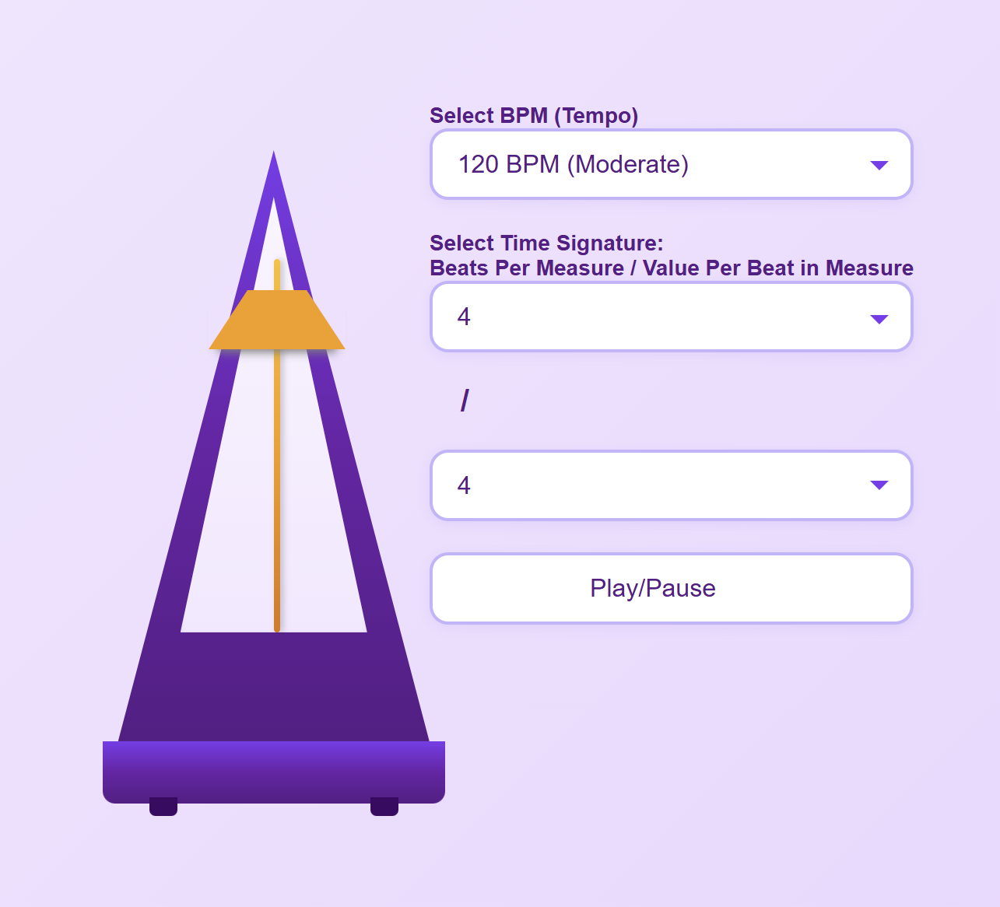
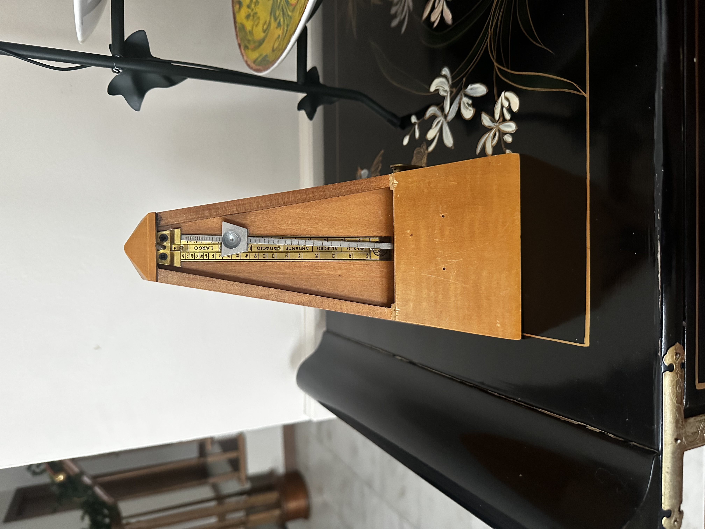

# Metronome App



This app is hosted on GitHub Pages: [Sam Bajis Metronome App.](https://samanthacbajis.github.io/sambajis-metronome-web-app/src/public/index.html "GitHub Pages")

## Approach to Metronome App
This app was made in Visual Studio Code using Node.js, Typescript and the Web Audio API. It was mostly developed and tested in Chrome, but also tested in Microsoft Edge, Firefox and Safari. I wanted to begin with a visual so I made a metronome that looked like one I had one growing up. So I started with a visual and then put some shapes together.<br /> 


Then to begin working on the app I read through the Web Audio API documentation to learn more about it as I have never used it before. From the documenation I was able to implement a start/stop button with a ticking mp3 I found online; and then I went from there getting the bpm and time signature.

## Instructions: How to Install and Run App
Go to the ```<> Code``` button on the repository. You will need to have this repo on your Desktop through either: 
- Downloading a ZIP: click the "Download ZIP" option and then open the repo on your Desktop and then in an IDE, like Visual Studio
- Cloning the project: use the web URL by opening your Command Prompt, or Terminal, navigate to your Desktop```cd Desktop```and run the command:<br />
```git clone https://github.com/SamanthaCBajis/sambajis-metronome-web-app.git```<br /> 

Next, you will want to make sure Node is installed and you have/are on the right version
[Node.js Download.](https://nodejs.org/en/download "Node.js")

Then, open a terminal in your VS Code and check/change the Node Version to 24.12.0.<br />
```node -v```<br /> 
```nvm use 24.12.0```<br /> 
Then, install node_dependencies and make sure you are on npm version 11.6.2.<br />
```npm i```<br /> 
```npm use 11.6.2```<br />
Once all that is done we can run the project! In your terminal navigate to the public folder,<br />
```cd src```<br /> 
```cd public```<br />
Then, run the "npm run dev" command and a link for the app should come up in your terminal as ```http://localhost:3000```<br />
```npm run dev```<br /> 
CTRL + click on the ```http://localhost:3000``` link to open the app in the browser!

## How to use the Metronome App
This app allows you to:
- Set the Tempo (or BPM ex. 90, 120, 200)
- Set the Time Signature (ex. 4/4, 3/4, 6/8)
- Play/Pause the Metronome <br />

How you do so is by selecting any option shown in the dropdowns and then click the button to Play/Pause the metronome.

## Design decisions
I designed the app to be mobile first. Breakpoint(Screen Sizes) are: 480px > 768px > 1024px > 1300px. I also wanted a swinging animation for the pendulum for the user to know that the metronome is currently running, or not running, and their bpm/time signature is set.<br /> 

**Note:** The pendulum swinging is not in sync with the BPM. It swings on click of the Play/Pause button

# Authors
• Samantha Cayla Bajis - _Initial work_ - SamBajis

# Acknowledgments
To make **_Metronome Web App_** possible:

-[Web Audio API](https://developer.mozilla.org/en-US/docs/Web/API/Web_Audio_API) For Documentation

-[Pxabay](https://pixabay.com/) for Audio Source (Ticking noise)